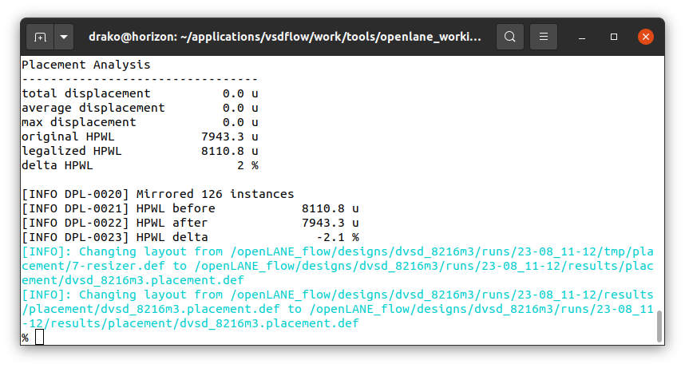
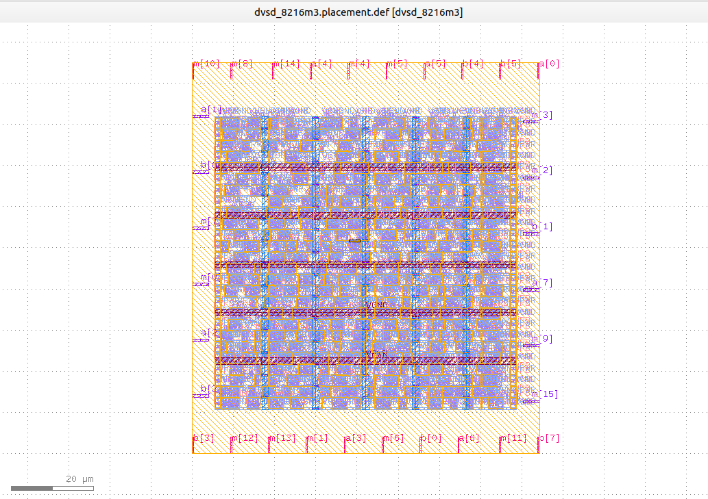
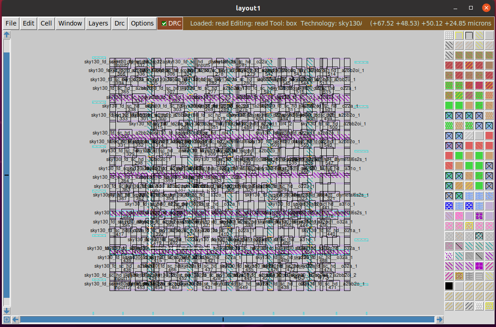
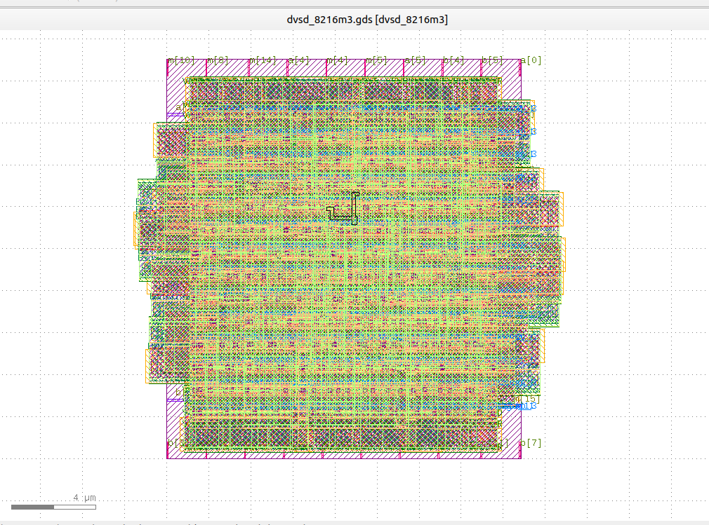

# RTL to GDS for a Modified 8-bit Dadda Multiplier using 3:2 Compressors with sky130 PDK and OpenLane

**Contents:**

<!-- @import "[TOC]" {cmd="toc" depthFrom=2 depthTo=6 orderedList=false`} -->

<!-- code_chunk_output -->

- [RTL to GDS for a Modified 8-bit Dadda Multiplier using 3:2 Compressors with sky130 PDK and OpenLane](#rtl-to-gds-for-a-modified-8-bit-dadda-multiplier-using-32-compressors-with-sky130-pdk-and-openlane)
  - [Verification](#verification)
  - [OpenLane Flow](#openlane-flow)
    - [Preparation](#preparation)
    - [Synthesis](#synthesis)
    - [Floor Planning](#floor-planning)
    - [Placement](#placement)
    - [Final GDS](#final-gds)
  - [Acknowledgements:](#acknowledgements)
  - [References:](#references)

<!-- /code_chunk_output -->

---

Dadda multiplier is a type of binary multiplier. Unlike Wallace multiplier, Dadda multiplier uses less munber of
gates for the reduction technique. A conventional Dadda multiplier uses a selection of half and full adders to sum
 the partial product in stages([Dadda reduction](https://en.wikipedia.org/wiki/Dadda_multiplier)). A modified Dadda multiplier uses 3:2 compressors to further reduce the 
speed and improve the efficiency of the design. The multiplier design uses two 8-bit inputs(A and B) to produce
a 16-bit output.


**Directory Structure:**

```sh
├──fig
│   └── images
├── notes
│   └── notes
├── README.md
├── rtl
│   ├── and1b.v
│   ├── compressor3to2.v
│   ├── dvsd_8216m3.v
│   ├── dvsd_8216m9.v
│   └── halfadder.v
├── sim
│   └── Makefile
└── tb
    ├── dvsd_8216m3_tb.v
    └── dvsd_8216m9_tb.v

```

## Verification

Module | Location | Description
--- |:---:| ---
dvsd_8216m3 | rtl  | Main module of Dadda Multiplication
halfadder | rtl  | Performs addition of two bit binary numbers 
compressor3to2 | rtl   | Performs addition of three bit binary numbers
and1b | rtl  | Performs logical AND operation
dvsd_8216m3_tb | tb  | Testbench for dvsd_8216m3 module
dvsd_8216m9 | rtl  | System mutiplication for two 8-bit numbers 
dvsd_8216m9_tb | tb  | Testbech for dvsd_8216m9

To verify the `dvsd_8216m3` code, go inside the `sim` directory and issue the below **make** command. It will also open the gtkwave to view the output waveforms.

```sh
make test1
```

this shall display the result as follows

```sh
Time            A               B               M(Obtained)             P(Required)
0.000 ns        0000 0000       0000 0000       0000 0000 0000 0000     0000 0000 0000 0000
2.000 ns        0010 0100       0011 0101       0000 0111 0111 0100     0000 0111 0111 0100
6.000 ns        1000 0001       0101 1110       0010 1111 0110 1110     0010 1111 0101 1110
10.000 ns       0000 1001       1101 0110       0000 0111 1000 0110     0000 0111 1000 0110
14.000 ns       0110 0011       0101 0110       0010 0001 0101 0010     0010 0001 0100 0010
18.000 ns       1111 1111       1111 1111       1111 1110 0000 0001     1111 1110 0000 0001
```

And it shall be displayed using GTKWave viewer


## OpenLane Flow


OpenLANE flow consists of several stages. By default, all flow steps are run in sequence. Each stage may consist of multiple sub-stages. OpenLANE can also be run interactively as shown here.

1. Synthesis

  
* Yosys - Performs RTL synthesis using GTech mapping
* abc - Performs technology mappin to standard cells described in the PDK. We can adjust synthesis techniques using different integrated abc scripts to get desired results
* OpenSTA - Performs static timing analysis on the resulting netlist to generate timing reports
* Fault – Scan-chain insertion used for testing post fabrication. Supports ATPG and test patterns compaction
  

2. Floorplan and PDN

  
* Init_fp - Defines the core area for the macro as well as the rows (used for placement) and the tracks (used for routing)
* Ioplacer - Places the macro input and output ports
* PDN - Generates the power distribution network
Tapcell - Inserts welltap and decap cells in the floorplan
* Placement – Placement is done in two steps, one with global placement in which we place the designs across the chip, but they will not be legal placement with some standard cells overlapping each other, to fix this we perform a detailed placement which legalizes the design and ensures they fit in the standard cell rows
* RePLace - Performs global placement
* Resizer - Performs optional optimizations on the design
* OpenPhySyn - Performs timing optimizations on the design
* OpenDP - Perfroms detailed placement to legalize the globally placed components
  
3. CTS
  
* TritonCTS - Synthesizes the clock distribution network

4. Routing
  
* FastRoute - Performs global routing to generate a guide file for the detailed router

* TritonRoute - Performs detailed routing from global routing guides
SPEF-Extractor - Performs SPEF extraction that include parasitic information
  

5. GDSII Generation

  
* Magic - Streams out the final GDSII layout file from the routed def
  

6. Checks

  
* Magic - Performs DRC Checks & Antenna Checks
* Netgen - Performs LVS Checks 

For complete information regarding the openlane flow visit [Advanced OpenLANE Workshop](https://gitlab.com/gab13c/openlane-workshop#about-the-project)

### Preparation 

I shall be working with docker to load the OpenLane Flow image, to setup and install openlance with docker refer [Setting up OpenLANE](https://github.com/efabless/openlane). 


To begin with add the project to the `designs/src` folder. Now lets try to open the design with openlane. Use `make mount` to start the openlane image through docker.


Let's prepare our design with `flow.tcl` script, optionally `-init_design_config` can be appended to add the configuration file to the design. Invoke openlane along with the design

```
flow.tcl -design dvsd_8216m3 -init_design_config
```


You can visit your design again with openlane in interactive  mode

```sh
flow.tcl -design dvsd_8216m3 -interactive
```

### Synthesis


Lets now run the synthesis using

```
run_synthesis
```

**Synthesis results:**


Viewing the syntheiszed rtl code with yosys. within the `runs` directory

```
xdot tmp/synthesis/post_techmap.dot
```


### Floor Planning 


To run floor planning in openlane

```sh
run_floorplan
```

**Floor-planning Results:**


You can view the floor-planning resuts using magic

```
magic -T $PDK_ROOT/sky130A/libs.tech/magic/sky130A lef read tmp/merged.lef def read results/floorplan/dvsd_8216m9.floorplan.def
```


### Placement 


To run placement 

```sh
run_placement
```







### Final GDS




## Acknowledgements:

* [Kunal Ghosh](https://github.com/kunalg123), Co-founder, VSD Corp. Pvt. Ltd.

## References:

**Research Papers**

- [ ] Jorge Tonfat, Ricardo Reis, South Symposium on Microelectronics, Low Power 3-2 and 4-2 Adder Compressors Implemented Using ASTRAN.
- [ ] Lavanya. M, Ranjan K. Senapati, JVR Ravindra, International Journal of Engineering Research and Technology, Low-Power Near-Explicit 5:2 Compressor for Superior Performance Multipliers

**Websites**

* Advanced OpenLANE Workshop: https://gitlab.com/gab13c/openlane-workshop#about-the-project
* OpenLANE: https://github.com/efabless/openlane
* Dada multiplier wiki: https://en.wikipedia.org/wiki/Dadda_multiplier